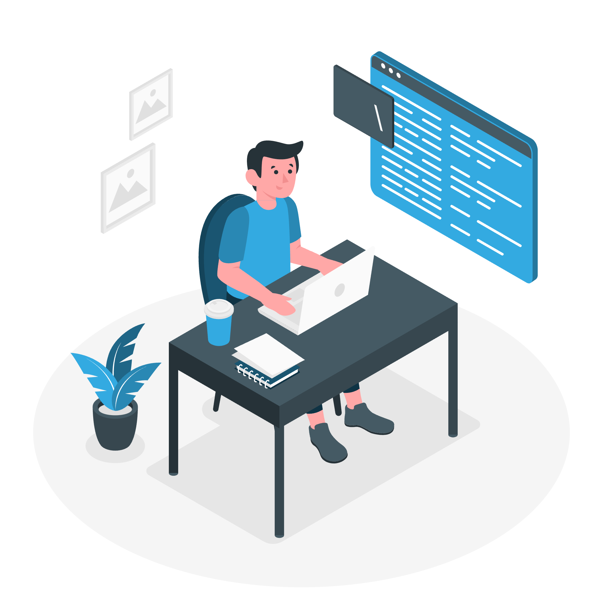

### Hello, I'm Hugo Ramon Pereira 👋

I’m a frontend developer that loves coding, design and modern interfaces. I currently work as a React.js Developer. 

- 💻 Currently I am working hard to improve my skills with Next.js.
- 🖥️ I am also learning Node.js aspiring to be a Fullstack Developer.
- 📱 I have also started my journey as a Mobile Developer with React Native.
- 👨🏻‍💻 The tecnologies I work daily with are: ReactJS, NextJS, Typescript and Javascript, Styled-Components, TailwindCSS, and so many more.

“The only thing standing between you and outrageous success is continuous progress” - Dan Waldschmidt
